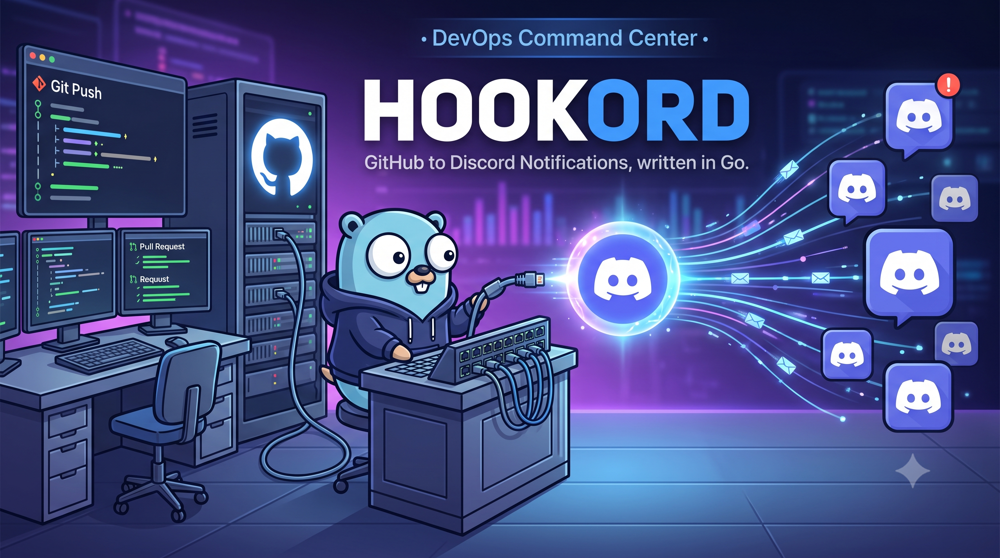

# Hookord - GitHub ↔ Discord Notification Bridge



Hookord é uma ponte de notificações entre GitHub e Discord desenvolvida em Go, focada em fornecer embeds modernos, organizados e ricas em informações.

## Funcionalidades

*   **Embeds Personalizados:** Design superior à integração nativa.
*   **Atualização de Mensagens:** Edita mensagens existentes em vez de criar novas para o mesmo evento (ex: atualização de status de PR ou progresso de Workflow).
*   **Roteamento por Categoria:** Envie diferentes tipos de eventos para diferentes canais do Discord.
*   **Arquitetura Escalável:** Baseado em Clean Architecture e DDD.
*   **Observabilidade:** Health checks, métricas Prometheus e logs estruturados.

## Requisitos

*   Go 1.22+
*   Redis
*   Docker & Docker Compose (opcional)

## Configuração

1.  Crie um arquivo `.env` na raiz do projeto (veja `.env.example`).
2.  Configure as seguintes variáveis:
    *   `DISCORD_TOKEN`: Token do seu Bot do Discord.
    *   `GITHUB_SECRET`: Segredo configurado no Webhook do GitHub.
    *   `REDIS_URL`: URL de conexão do Redis (ex: `redis://localhost:6379`).
    *   `DISCORD_CHANNEL_PULL_REQUESTS`: ID do canal para PRs.
    *   `DISCORD_CHANNEL_ISSUES`: ID do canal para Issues.
    *   `DISCORD_CHANNEL_WORKFLOWS`: ID do canal para Workflows.
    *   `DISCORD_CHANNEL_REPOSITORY`: ID do canal para eventos de repositório (push, release, etc).

## Execução

### Via Docker

```bash
docker-compose up -d
```

### Localmente

```bash
go run cmd/hookord/main.go
```

## Configuração do Webhook no GitHub

1.  Vá nas configurações do seu repositório ou organização.
2.  Webhooks -> Add webhook.
3.  Payload URL: `http://seu-dominio.com/webhook`
4.  Content type: `application/json`
5.  Secret: O mesmo valor definido em `GITHUB_SECRET`.
6.  Selecione "Let me select individual events" e escolha os eventos suportados.

## Arquitetura

O projeto segue os princípios de Clean Architecture:

*   **cmd/**: Ponto de entrada da aplicação.
*   **internal/domain/**: Entidades e interfaces de negócio.
*   **internal/application/**: Casos de uso e orquestração.
*   **internal/infrastructure/**: Implementações de adaptadores externos (Discord, Redis, Config).
*   **internal/events/**: Lógica específica para cada categoria de evento.

## Eventos Suportados

*   Pull Requests (Open, Reopen, Close, Merge)
*   Issues (Open, Reopen, Close)
*   Workflows (Em breve)
*   Repository (Push, Release, Tags - Em breve)

---
Desenvolvido por Julio Filizzola.
